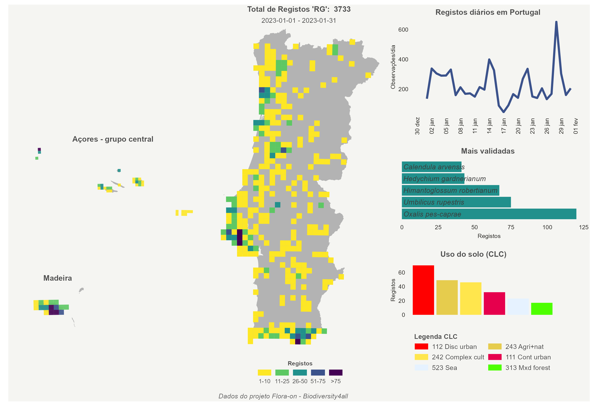
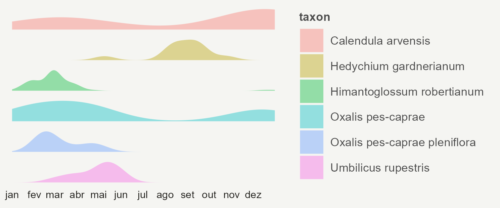
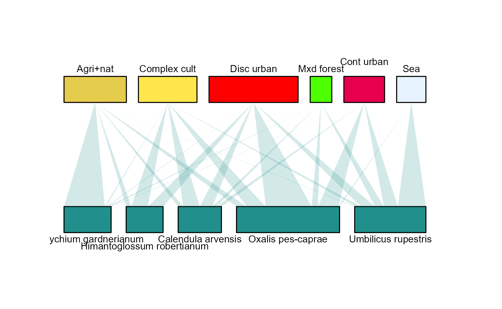

# flora_on

<!-- badges: start -->
<!-- badges: end -->

The goal of this repo is to fetch data from the Flora-on project at [Biodiversity4All](https://www.biodiversity4all.org/projects/flora-on) with the API provided by [ropensci](https://ropensci.org/) package `rinat`, get basic metrics and maps to communicate the progress of Citizen Science activity on social media.

Data with [Research Grade](https://www.inaturalist.org/posts/26549-what-is-a-verifiable-observation-and-how-does-it-reach-research-grade) level will be curated by Flora-on team and integrated into the [Flora-on Portal](http://www.flora-on.pt), the largest repository and database of vascular flora in Portugal.

Flora-on is a project created and maintained by [Sociedade Portuguesa de Botânica](http://www.spbotanica.pt).

### Typical output

#### Monthly Map

#### Week flowering map

#### CORINE map

